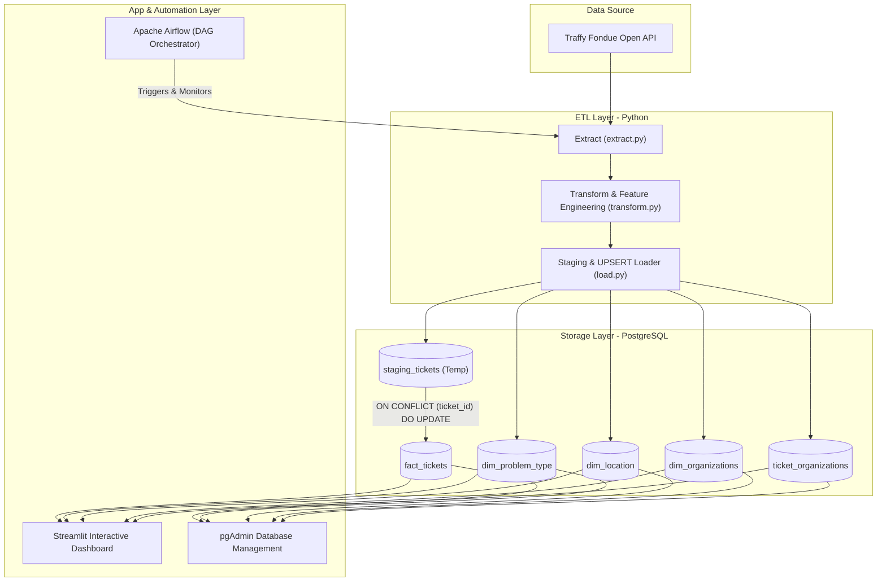

# Traffy Fondue End-to-End Automated Data Pipeline

An enterprise-grade, automated Data Engineering pipeline designed to extract, clean, model, load, and visualize public municipal issue data from Bangkok's **Traffy Fondue** platform.

This project transforms unstructured municipal ticket data into an optimized **Star Schema** data warehouse in **PostgreSQL**, fully orchestrated with **Apache Airflow**, containerized via **Docker**, and presented through an interactive **Streamlit Dashboard**.

---

## Architecture Overview



---

## Project Structure

```text
traffy-fondue-etl-pipeline/
├── dags/                     # Apache Airflow DAG workflows
│   └── etl_dag.py            # Monthly automated ETL orchestration DAG
├── dashboard/                # Analytics UI Layer
│   └── app.py                # Streamlit interactive dashboard application
├── notebooks/                # Exploratory Data Analysis & Prototyping
│   └── 01_eda_exploration.ipynb
├── scripts/                  # Core Modular ETL Pipeline
│   ├── config.py             # Centralized environment & connection configuration
│   ├── extract.py            # Traffy Fondue API extraction module
│   ├── transform.py          # Data cleaning, feature engineering & normalization
│   ├── db.py                 # SQLAlchemy engine & database schema initialization
│   ├── load.py               # Dimension mapping, FK resolution & SQL UPSERT loader
│   └── main.py               # CLI runner & pipeline orchestrator
├── sql/                      # Data Modeling & DDL Artifacts
│   ├── schema.sql            # PostgreSQL DDL (Star Schema & Indexes)
│   └── schema.dbml           # DBML Data Model specification
├── .env.example              # Environment variables template
├── .gitignore                # Git exclusion rules
├── docker-compose.yml        # Multi-container orchestration (PostgreSQL, pgAdmin, Airflow)
├── README.md                 # Project documentation
└── requirements.txt          # Python package dependencies
```

---

## End-to-End Pipeline Workflow

1. **Extraction (`scripts/extract.py`):**
   * Connects to Traffy Fondue Open API with dynamic query parameters and user credentials.
   * Fetches monthly municipal ticket datasets (e.g., 37,000+ records per month) safely into Pandas DataFrames with automated HTTP error handling.

2. **Transformation (`scripts/transform.py`):**
   * Normalizes category hierarchies, parses geographic coordinates, calculates precise task completion durations, imputes missing values, and builds engineered feature flags.

3. **Loading & Dimensional Modeling (`scripts/load.py`):**
   * Performs idempotent upserts (`ON CONFLICT DO NOTHING`) on Dimension Tables (`dim_problem_type`, `dim_location`, `dim_organizations`).
   * Maps natural text keys to surrogate Foreign Keys.
   * Utilizes a **Temporary Staging Table (`staging_tickets`) + SQL `UPSERT` (`ON CONFLICT (ticket_id) DO UPDATE`)** to insert new records and update changing issue statuses without primary key violations.
   * Populates the Bridge Table (`ticket_organizations`) to capture many-to-many relationships between tickets and assigned agencies.

4. **Orchestration (`dags/etl_dag.py`):**
   * Scheduled via **Apache Airflow** using `@monthly` cron intervals.
   * Configured with automated retry logic (`retries=1`, `retry_delay=5m`) and state validation tasks.

5. **Analytics & Presentation (`dashboard/app.py`):**
   * Built with **Streamlit** and **Plotly Express**, allowing users to explore all Star Schema tables dynamically, filter issues, and inspect state distributions.

---

## Data Cleaning, Quality & Engineering Resolutions

During exploratory analysis, several real-world data quality anomalies were identified. Below is the technical resolution matrix applied in `scripts/transform.py` & `scripts/load.py`:

| Data Anomaly / Issue | Root Cause | Engineering Resolution |
| :--- | :--- | :--- |
| **1. 100% Duplicate Columns** | `problemtype_tag` contained identical values to `type` after normalization. | Validated equivalence via string comparison (100% match) and safely dropped `problemtype_tag` to eliminate redundancy. |
| **2. Dynamic Hierarchy & Schema Drift** | Problem category strings (`type`) varied in depth (e.g., `ไฟฟ้า`, `ถนน -> ท่อระบายน้ำ`, `ความสะอาด -> ขยะ -> ถังขยะเต็ม`). | Applied string splitting capped at 3 levels (`str.split("->", n=2)`) into `main_category`, `sub_category`, and `detail_category` to prevent schema drift. |
| **3. Missing Coordinates** | Unstructured `coords` strings (e.g., `"100.5, 13.7"`). | Extracted and validated into numerical `longitude` and `latitude` floats, handling invalid formats gracefully. |
| **4. Negative / Invalid Durations** | Out-of-order timestamps (e.g., `timestamp_finished` earlier than `timestamp_inprogress` due to system resets). | Recalculated durations (`duration_minutes_total`, `calculated_from_start`, `calculated_from_inprogress`) with strict lower-bound clipping (`max(0, diff)`). |
| **5. Missing Text Fields** | `comment` and `address` had `NaN` values. | Imputed with standard fallback strings (`"Not specified"`, `"Unspecified Address"`) to maintain data integrity. |
| **6. Case State Transitions** | Tickets progress over time (e.g., Month 1: `"กำลังดำเนินการ"` -> Month 2: `"เสร็จสิ้น"`). | Replaced naive `INSERT` with **Staging Table + SQL UPSERT** (`ON CONFLICT (ticket_id) DO UPDATE SET state = EXCLUDED.state, ...`), preventing primary key crashes while keeping state fresh. |
| **7. Multi-Agency Assignments** | `organization` contained comma-separated lists of agencies. | Extracted `primary_org`, `latest_action_org`, and `org_count` as features, while normalizing full multi-agency relationships into a dedicated Bridge Table (`ticket_organizations`). |
| **8. Internal Rework Detection** | Cases transferred multiple times between agencies. | Engineered a boolean feature `is_internal_rework` (`org_count > 3`) to flag complex or re-routed municipal tickets. |

---

## Database Design & Star Schema Modeling

To optimize analytical queries and dashboard performance, the database is structured into a **Star Schema**:

```text
                                   +-----------------------+
                                   |   dim_problem_type    |
                                   +-----------------------+
                                   | PK  type_id           |
                                   |     main_category     |
                                   |     sub_category      |
                                   |     detail_category   |
                                   +-----------+-----------+
                                               | 1
                                               |
                                               | N
        +--------------------+     |     +-------------------------+     1     +------------------+
        |    dim_location    |-----+----->      fact_tickets       |<----------| dim_organizations|
        +--------------------+     |     +-------------------------+           +------------------+
        | PK  location_id    |     |     | PK  type_id             |           | PK  org_id       |
        |     subdistrict    |     |     | FK  location_id         |           |     org_name     |
        |     district       |     |     | FK  primary_org_id      |           +--------+---------+
        |     province       |     |     | FK  latest_action_org_id|                    | 1
        +--------------------+     |     |     state, timestamp... |                    |
                                   |     +-------------------------+                    |
                                   |                                                    |
                                   |                                                    | N
                                   |             +-----------------------+              |
                                   +------------>|  ticket_organizations |<-------------+
                                                 +-----------------------+
                                                 | PK,FK1  ticket_id     |
                                                 | PK,FK2  org_id        |
                                                 |         sequence_order|
                                                 |         is_primary    |
                                                 |         is_latest     |
                                                 +-----------------------+
```

### Table Dictionary:
1. **`fact_tickets` (Fact Table):** Stores individual municipal ticket metrics, timestamps, status, recalculated durations, ratings (`star`), rework flags, and foreign key references.
2. **`dim_problem_type` (Dimension):** Normalized 3-level problem hierarchy.
3. **`dim_location` (Dimension):** Geographic administrative boundaries (`subdistrict`, `district`, `province`).
4. **`dim_organizations` (Dimension):** Unique list of municipal agencies and district offices.
5. **`ticket_organizations` (Bridge Table):** Captures the N:M relationship between tickets and multiple assigned agencies in sequential order.

---

## Quick Start Guide

### 1. Prerequisites
* **Docker & Docker Compose** installed
* **Python 3.11+**

### 2. Environment Setup
Clone the repository and copy the environment template:
```bash
git clone https://github.com/ThnaChamp/traffy-fondue-etl-pipeline.git
cd traffy-fondue-etl-pipeline
cp .env.example .env
```

### 3. Launch Container Services
Start PostgreSQL, pgAdmin, and Apache Airflow in detached mode:
```bash
docker compose up -d
```

### 4. Access Services
* **Streamlit Dashboard:**
  ```bash
  streamlit run dashboard/app.py
  ```
  Open `http://localhost:8501` to interact with the dashboard.
* **Apache Airflow Web UI:**
  Navigate to `http://localhost:8088` (Credentials: `admin` / `admin`).
* **pgAdmin Database Management:**
  Navigate to `http://localhost:5050` (Credentials: `admin@example.com` / `admin`).

---

## Tech Stack

* **Language:** Python 3.11
* **Data Processing & ETL:** Pandas, NumPy, SQLAlchemy, Psycopg2
* **Database:** PostgreSQL 16
* **Orchestration:** Apache Airflow 2.9
* **Visualization & UI:** Streamlit, Plotly Express
* **Containerization & Infra:** Docker, Docker Compose
